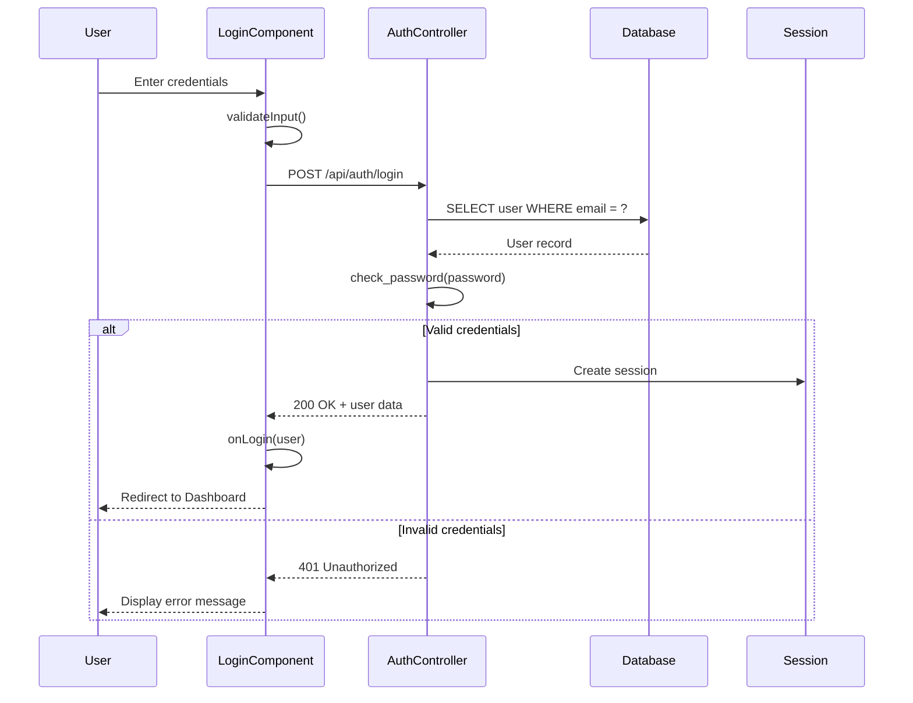
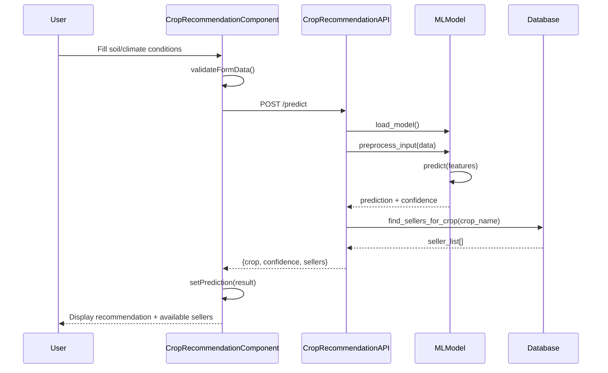
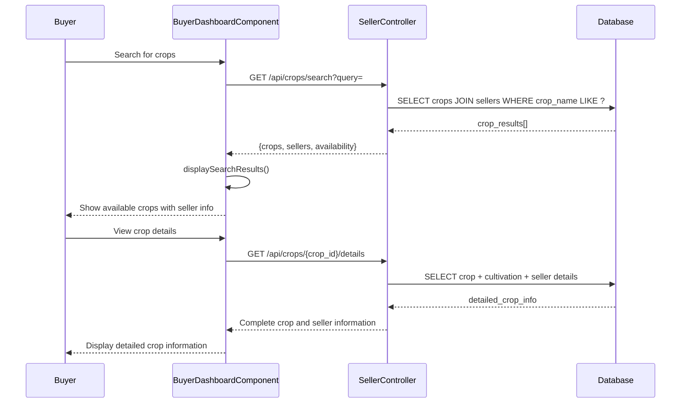

# Crop Recommendation System - Comprehensive Technical Analysis

## Table of Contents
1. [System Overview](#system-overview)
2. [Class Diagram](#class-diagram)
3. [Entity-Relationship (ER) Diagram](#entity-relationship-er-diagram)
4. [Sequence Diagrams](#sequence-diagrams)
5. [Use Case Diagram](#use-case-diagram)
6. [Test Case Chart](#test-case-chart)

---

## System Overview

The Crop Recommendation System is a full-stack web application that combines machine learning-based crop prediction with a comprehensive agricultural marketplace. The system consists of:

- **Frontend**: React.js with TypeScript, responsive UI components
- **Backend**: Python Flask with SQLAlchemy ORM, RESTful API architecture
- **Database**: MySQL with comprehensive agricultural data schema
- **ML Engine**: Scikit-learn based crop recommendation model
- **Authentication**: Session-based authentication with role management

---

## Class Diagram

```mermaid
classDiagram
    %% Backend Models
    class User {
        -String id
        -String email
        -String password_hash
        -String user_type
        -Boolean is_active
        -Boolean email_verified
        -DateTime created_at
        -DateTime updated_at
        +set_password(password: String): void
        +check_password(password: String): Boolean
        +to_dict(): Dict
        -generate_password_hash(password: String): String
        -check_password_hash(hash: String, password: String): Boolean
    }

    class Province {
        -Integer id
        -String name
        -DateTime created_at
        +to_dict(): Dict
        +__repr__(): String
    }

    class District {
        -Integer id
        -String name
        -Integer province_id
        -DateTime created_at
        +to_dict(): Dict
        +__repr__(): String
    }

    class City {
        -Integer id
        -String name
        -Integer district_id
        -DateTime created_at
        +to_dict(): Dict
        +__repr__(): String
    }

    class Seller {
        -String id
        -String user_id
        -String business_name
        -String business_registration_number
        -String business_type
        -String contact_number
        -String secondary_contact
        -String business_email
        -String website
        -String address_line_1
        -String address_line_2
        -String postal_code
        -Integer province_id
        -Integer district_id
        -Integer city_id
        -String shop_name
        -String shop_type
        -Integer establishment_year
        -Float shop_size_sqft
        -Text opening_hours
        -String operating_days
        -Text services_offered
        -Boolean delivery_available
        -Boolean home_delivery
        -Boolean pickup_available
        -Boolean is_verified
        -Text verification_documents
        -Boolean is_active
        -Text description
        -Text specialties
        -Text certifications
        -DateTime created_at
        -DateTime updated_at
        -DateTime verified_at
        +get_full_address(): String
        +to_dict(include_crops: Boolean): Dict
        -format_location_data(): Dict
        +__repr__(): String
    }

    class SellerCrop {
        -String id
        -String seller_id
        -String crop_name
        -String crop_variety
        -Boolean is_available
        -Float price_per_kg
        -Float price_per_unit
        -String unit_type
        -Float quantity_available
        -Float minimum_order
        -String harvest_season
        -String best_quality_months
        -String quality_grade
        -Boolean organic_certified
        -Boolean pesticide_free
        -DateTime created_at
        -DateTime updated_at
        +to_dict(include_cultivation: Boolean): Dict
        -calculate_price_display(): String
        +__repr__(): String
    }

    class CropCultivation {
        -String id
        -String seller_crop_id
        -Text seed_nursery
        -Text land_preparation
        -Text planting
        -Text crop_management
        -Text seed_requirements
        -Text cultivation_steps
        -String irrigation_method
        -Text fertilizer_used
        -Text pest_control_methods
        -Text harvesting_method
        -Text post_harvest_handling
        -String soil_type
        -String water_requirements
        -String sunlight_requirements
        -String temperature_range
        -String planting_season
        -Integer growing_duration_days
        -DateTime created_at
        -DateTime updated_at
        +to_dict(): Dict
        -validate_cultivation_data(): Boolean
        +__repr__(): String
    }

    %% Frontend Components (TypeScript/React)
    class LoginComponent {
        -FormData formData
        -Boolean loading
        -String error
        +handleInputChange(event: ChangeEvent): void
        +handleSubmit(event: FormEvent): Promise<void>
        -validateInput(): Boolean
        -showErrorMessage(message: String): void
        +render(): JSX.Element
    }

    class CropRecommendationComponent {
        -FormData formData
        -PredictionResult prediction
        -Boolean loading
        -String error
        +handleInputChange(field: String, value: String): void
        +handleSubmit(event: FormEvent): Promise<void>
        +resetForm(): void
        -validateFormData(): Boolean
        -makePredictionRequest(): Promise<PredictionResult>
        +render(): JSX.Element
    }

    class SellerDashboardComponent {
        -Array<SellerCrop> crops
        -Boolean loading
        -String error
        +loadSellerCrops(): Promise<void>
        +addNewCrop(cropData: CropData): Promise<void>
        +updateCrop(cropId: String, cropData: CropData): Promise<void>
        +deleteCrop(cropId: String): Promise<void>
        -refreshCropsList(): void
        +render(): JSX.Element
    }

    class BuyerDashboardComponent {
        -User user
        -Array<Object> searchResults
        -Boolean loading
        +searchCrops(query: String): Promise<void>
        +viewCropDetails(cropId: String): void
        +contactSeller(sellerId: String): void
        -displaySearchResults(): JSX.Element
        +render(): JSX.Element
    }

    %% API Controllers
    class AuthController {
        +register(request: Request): Response
        +login(request: Request): Response
        +get_profile(user_id: String): Response
        +update_profile(user_id: String, request: Request): Response
        -validate_registration_data(data: Dict): Boolean
        -authenticate_user(email: String, password: String): User
        -create_session(user: User): String
    }

    class SellerController {
        +create_seller(request: Request): Response
        +get_seller(seller_id: String): Response
        +update_seller(seller_id: String, request: Request): Response
        +get_seller_crops(seller_id: String): Response
        +add_crop(seller_id: String, request: Request): Response
        +update_crop(crop_id: String, request: Request): Response
        +delete_crop(crop_id: String): Response
        -validate_seller_data(data: Dict): Boolean
        -check_seller_permissions(user_id: String, seller_id: String): Boolean
    }

    class CropRecommendationAPI {
        -MLModel model
        -LabelEncoders encoders
        +predict_crop(request: Request): Response
        +health_check(): Response
        -load_ml_model(): MLModel
        -preprocess_input(data: Dict): Array
        -find_sellers_for_crop(crop_name: String): Array<Seller>
        -get_database_connection(): Connection
    }

    %% ML Model Components
    class MLModel {
        -sklearn_model trained_model
        -Dict encoders
        +predict(input_features: Array): String
        +predict_proba(input_features: Array): Array<Float>
        -preprocess_features(raw_input: Dict): Array
        +get_confidence_score(probabilities: Array): Float
    }

    %% Relationships
    User ||--o| Seller : "has profile"
    Province ||--o{ District : "contains"
    District ||--o{ City : "contains"
    Province ||--o{ Seller : "located in"
    District ||--o{ Seller : "located in"
    City ||--o{ Seller : "located in"
    Seller ||--o{ SellerCrop : "sells"
    SellerCrop ||--|| CropCultivation : "has cultivation info"
    
    %% Component Dependencies
    LoginComponent ..> AuthController : "API calls"
    CropRecommendationComponent ..> CropRecommendationAPI : "ML prediction"
    SellerDashboardComponent ..> SellerController : "CRUD operations"
    BuyerDashboardComponent ..> SellerController : "search operations"
    CropRecommendationAPI ..> MLModel : "uses"
    AuthController ..> User : "manages"
    SellerController ..> Seller : "manages"
    SellerController ..> SellerCrop : "manages"
```

---

## Entity-Relationship (ER) Diagram

```mermaid
erDiagram
    USERS {
        VARCHAR(36) id PK
        VARCHAR(120) email UK
        VARCHAR(255) password_hash
        VARCHAR(20) user_type
        BOOLEAN is_active
        BOOLEAN email_verified
        DATETIME created_at
        DATETIME updated_at
    }

    PROVINCES {
        INTEGER id PK
        VARCHAR(100) name UK
        DATETIME created_at
    }

    DISTRICTS {
        INTEGER id PK
        VARCHAR(100) name
        INTEGER province_id FK
        DATETIME created_at
    }

    CITIES {
        INTEGER id PK
        VARCHAR(100) name
        INTEGER district_id FK
        DATETIME created_at
    }

    SELLERS {
        VARCHAR(36) id PK
        VARCHAR(36) user_id FK,UK
        VARCHAR(200) business_name
        VARCHAR(50) business_registration_number UK
        VARCHAR(50) business_type
        VARCHAR(20) contact_number
        VARCHAR(20) secondary_contact
        VARCHAR(120) business_email
        VARCHAR(255) website
        VARCHAR(255) address_line_1
        VARCHAR(255) address_line_2
        VARCHAR(10) postal_code
        INTEGER province_id FK
        INTEGER district_id FK
        INTEGER city_id FK
        VARCHAR(200) shop_name
        VARCHAR(50) shop_type
        INTEGER establishment_year
        FLOAT shop_size_sqft
        TEXT opening_hours
        VARCHAR(100) operating_days
        TEXT services_offered
        BOOLEAN delivery_available
        BOOLEAN home_delivery
        BOOLEAN pickup_available
        BOOLEAN is_verified
        TEXT verification_documents
        BOOLEAN is_active
        TEXT description
        TEXT specialties
        TEXT certifications
        DATETIME created_at
        DATETIME updated_at
        DATETIME verified_at
    }

    SELLER_CROPS {
        VARCHAR(36) id PK
        VARCHAR(36) seller_id FK
        VARCHAR(100) crop_name
        VARCHAR(100) crop_variety
        BOOLEAN is_available
        FLOAT price_per_kg
        FLOAT price_per_unit
        VARCHAR(20) unit_type
        FLOAT quantity_available
        FLOAT minimum_order
        VARCHAR(100) harvest_season
        VARCHAR(100) best_quality_months
        VARCHAR(20) quality_grade
        BOOLEAN organic_certified
        BOOLEAN pesticide_free
        DATETIME created_at
        DATETIME updated_at
    }

    CROP_CULTIVATIONS {
        VARCHAR(36) id PK
        VARCHAR(36) seller_crop_id FK,UK
        TEXT seed_nursery
        TEXT land_preparation
        TEXT planting
        TEXT crop_management
        TEXT seed_requirements
        TEXT cultivation_steps
        VARCHAR(100) irrigation_method
        TEXT fertilizer_used
        TEXT pest_control_methods
        TEXT harvesting_method
        TEXT post_harvest_handling
        VARCHAR(100) soil_type
        VARCHAR(100) water_requirements
        VARCHAR(100) sunlight_requirements
        VARCHAR(50) temperature_range
        VARCHAR(100) planting_season
        INTEGER growing_duration_days
        DATETIME created_at
        DATETIME updated_at
    }

    %% Relationships
    USERS ||--o| SELLERS : "user_id"
    PROVINCES ||--o{ DISTRICTS : "province_id"
    DISTRICTS ||--o{ CITIES : "district_id"
    PROVINCES ||--o{ SELLERS : "province_id"
    DISTRICTS ||--o{ SELLERS : "district_id"
    CITIES ||--o{ SELLERS : "city_id"
    SELLERS ||--o{ SELLER_CROPS : "seller_id"
    SELLER_CROPS ||--|| CROP_CULTIVATIONS : "seller_crop_id"
```



**Entity Descriptions:**

1. **USERS**: Core authentication entity storing user credentials and basic profile information
2. **PROVINCES**: Administrative division (highest level) - Sri Lankan provinces
3. **DISTRICTS**: Administrative division (middle level) within provinces
4. **CITIES**: Administrative division (lowest level) within districts
5. **SELLERS**: Business entities selling agricultural products with comprehensive business details
6. **SELLER_CROPS**: Individual crop offerings by sellers with pricing and availability
7. **CROP_CULTIVATIONS**: Detailed agricultural cultivation information for each crop

**Key Relationships:**
- One-to-One: User ↔ Seller (each user can have one seller profile)
- One-to-Many: Province → Districts → Cities (hierarchical location structure)
- One-to-Many: Seller → SellerCrops (seller can offer multiple crops)
- One-to-One: SellerCrop ↔ CropCultivation (each crop has cultivation details)

---

## Sequence Diagrams

### 1. User Authentication Flow



### 2. Crop Recommendation Flow



### 3. Seller Registration and Crop Management

```mermaid
sequenceDiagram
    participant S as Seller
    participant SRC as SellerRegistrationComponent
    participant SC as SellerController
    participant SBC as SellerBusinessComponent
    parameter DB as Database

    S->>SRC: Fill business registration
    SRC->>SC: POST /api/seller/register
    SC->>DB: INSERT INTO sellers
    DB-->>SC: seller_id
    SC-->>SRC: Registration successful

    S->>SBC: Add new crop
    SBC->>SC: POST /api/seller/{id}/crops
    SC->>DB: INSERT INTO seller_crops
    SC->>DB: INSERT INTO crop_cultivations
    DB-->>SC: Success
    SC-->>SBC: Crop added successfully
    SBC-->>S: Update crop list display
```

### 4. Buyer Crop Search Flow



---

## Use Case Diagram

```mermaid
graph TB
    %% Actors
    Buyer[👤 Buyer/Farmer]
    Seller[🏪 Agricultural Seller]
    Admin[👨‍💼 System Administrator]
    MLSystem[🤖 ML Recommendation Engine]

    %% Authentication Use Cases
    subgraph "Authentication System"
        UC1[Register Account]
        UC2[User Login]
        UC3[Update Profile]
        UC4[Manage Sessions]
    end

    %% Buyer Use Cases
    subgraph "Buyer Features"
        UC5[Get Crop Recommendations]
        UC6[Input Soil Conditions]
        UC7[View Recommendation Results]
        UC8[Search Available Crops]
        UC9[Browse Seller Profiles]
        UC10[View Crop Details]
        UC11[Access Cultivation Info]
        UC12[Contact Sellers]
    end

    %% Seller Use Cases
    subgraph "Seller Management"
        UC13[Register Business]
        UC14[Manage Business Profile]
        UC15[Add Crop Listings]
        UC16[Update Crop Information]
        UC17[Set Pricing & Availability]
        UC18[Manage Inventory]
        UC19[Add Cultivation Details]
        UC20[Update Business Hours]
        UC21[Manage Certifications]
    end

    %% Admin Use Cases
    subgraph "Administration"
        UC22[Verify Seller Accounts]
        UC23[Manage Location Data]
        UC24[Monitor System Health]
        UC25[Manage User Accounts]
        UC26[System Configuration]
    end

    %% ML System Use Cases
    subgraph "ML Operations"
        UC27[Process Prediction Requests]
        UC28[Load ML Model]
        UC29[Feature Engineering]
        UC30[Generate Recommendations]
        UC31[Calculate Confidence Scores]
    end

    %% Relationships
    Buyer --> UC1
    Buyer --> UC2
    Buyer --> UC5
    Buyer --> UC6
    Buyer --> UC7
    Buyer --> UC8
    Buyer --> UC9
    Buyer --> UC10
    Buyer --> UC11
    Buyer --> UC12

    Seller --> UC1
    Seller --> UC2
    Seller --> UC3
    Seller --> UC13
    Seller --> UC14
    Seller --> UC15
    Seller --> UC16
    Seller --> UC17
    Seller --> UC18
    Seller --> UC19
    Seller --> UC20
    Seller --> UC21

    Admin --> UC22
    Admin --> UC23
    Admin --> UC24
    Admin --> UC25
    Admin --> UC26

    MLSystem --> UC27
    MLSystem --> UC28
    MLSystem --> UC29
    MLSystem --> UC30
    MLSystem --> UC31

    %% Include relationships
    UC5 -.-> UC27 : "includes"
    UC7 -.-> UC8 : "includes"
    UC10 -.-> UC11 : "includes"
    UC15 -.-> UC19 : "includes"
```

**Use Case Descriptions:**

**Buyer/Farmer:**
- Primary goal: Get accurate crop recommendations and find reliable sellers
- Can input soil and environmental conditions to get ML-based crop suggestions
- Can browse and search available crops from verified sellers
- Can access detailed cultivation information for recommended crops

**Agricultural Seller:**
- Primary goal: Manage business profile and crop inventory effectively
- Can register business with complete verification details
- Can manage comprehensive crop listings with pricing and availability
- Can provide detailed cultivation guidance to potential buyers

**System Administrator:**
- Primary goal: Maintain system integrity and user verification
- Can verify and manage seller accounts
- Can manage location hierarchies (provinces, districts, cities)
- Can monitor system performance and handle user issues

**ML Recommendation Engine:**
- Primary goal: Provide accurate crop recommendations based on input conditions
- Processes environmental and soil condition inputs
- Applies trained machine learning model for predictions
- Returns confidence scores and matches with available sellers

---

## Test Case Chart

| **Page/Feature** | **Objectives** | **Scope** | **Responsibility** |
|------------------|----------------|-----------|-------------------|
| **Login** | Successful login; invalid credentials error; redirects/session management | Username/password authentication, error states, redirect to Dashboard | QA, Backend Dev (auth API/lockout), Security/DevOps (session config) |
| **Registration** | User account creation; email validation; duplicate email handling | Form validation, user type selection (buyer/seller), database insertion | QA, Backend Dev (validation logic), Frontend Dev (form handling) |
| **Crop Recommendation** | ML prediction accuracy; input validation; seller integration | Soil/climate parameter input, ML model inference, seller lookup | QA, Data Science (ML model), Backend Dev (API integration) |
| **Seller Dashboard** | CRUD operations for crops; business profile management; inventory tracking | Seller authentication, crop management, business information updates | QA, Backend Dev (seller APIs), Frontend Dev (dashboard UI) |
| **Buyer Dashboard** | Crop search functionality; seller discovery; detailed crop information | Search algorithms, filtering, seller profile viewing, crop details | QA, Backend Dev (search APIs), Frontend Dev (search interface) |
| **Business Registration** | Seller onboarding; document verification; location selection | Multi-step form, file upload, location hierarchy, verification workflow | QA, Backend Dev (registration flow), Admin (verification process) |
| **Crop Management** | Add/edit/delete crops; cultivation details; pricing management | Crop CRUD operations, cultivation information, availability tracking | QA, Backend Dev (crop APIs), Seller (content management) |
| **ML Model Integration** | Prediction accuracy; response time; error handling | Model loading, feature preprocessing, prediction generation, confidence calculation | Data Science, QA, Backend Dev (API integration) |
| **Location Management** | Province/district/city hierarchy; location-based filtering | Administrative boundaries, hierarchical relationships, search by location | QA, Backend Dev (location APIs), Admin (location data) |
| **Seller Search** | Crop-based seller discovery; availability filtering; contact information | Search algorithms, availability status, seller details, contact methods | QA, Backend Dev (search logic), Seller (profile management) |

### **Test Categories:**

#### **1. Functional Testing**
- **User Authentication**: Login/logout, session management, password validation
- **Crop Recommendation**: ML model accuracy, input validation, result display
- **Seller Management**: Profile creation, crop listings, inventory updates
- **Search Functionality**: Crop search, seller discovery, filtering options
- **Data Integrity**: Database operations, relationship constraints, data validation

#### **2. Non-Functional Testing**
- **Performance**: Response time for ML predictions, database query optimization
- **Security**: Authentication security, data encryption, input sanitization
- **Usability**: User interface responsiveness, navigation flow, error messages
- **Compatibility**: Cross-browser testing, mobile responsiveness, device compatibility
- **Reliability**: System uptime, error recovery, data consistency

#### **3. Integration Testing**
- **Frontend-Backend**: API communication, data flow, error handling
- **Database Integration**: Data persistence, transaction management, referential integrity
- **ML Model Integration**: Model loading, prediction pipeline, result processing
- **External Services**: Email verification, file upload, location services

#### **4. System Testing**
- **End-to-End Workflows**: Complete user journeys from registration to crop recommendation
- **Load Testing**: Multiple concurrent users, database performance under load
- **Security Testing**: Authentication bypass attempts, SQL injection prevention
- **Data Migration**: Database schema updates, data preservation during upgrades

#### **5. User Acceptance Testing**
- **Buyer Scenarios**: Crop recommendation accuracy, seller discovery effectiveness
- **Seller Scenarios**: Business registration ease, crop management functionality
- **Admin Scenarios**: User verification process, system administration capabilities
- **Real-world Usage**: Actual agricultural data testing, regional crop variations

### **Quality Assurance Metrics:**
- **Test Coverage**: Minimum 85% code coverage for critical paths
- **Bug Density**: Less than 2 critical bugs per 1000 lines of code
- **Response Time**: ML predictions under 3 seconds, page loads under 2 seconds
- **Availability**: 99.5% system uptime during peak agricultural seasons
- **User Satisfaction**: Minimum 4.0/5.0 rating from beta testing farmers and sellers

---

## **System Architecture Summary**

This comprehensive analysis covers all aspects of the Crop Recommendation System:

1. **Class Diagram**: Shows detailed object-oriented structure with public/private methods and relationships
2. **ER Diagram**: Illustrates complete database schema with entities, attributes, and relationships
3. **Sequence Diagrams**: Demonstrates key system interactions and data flow
4. **Use Case Diagram**: Maps all user roles and their available system functions
5. **Test Case Chart**: Provides comprehensive testing strategy with responsibilities and scope

The system integrates modern web technologies with machine learning to provide a complete agricultural marketplace solution, supporting both crop recommendation and seller-buyer connections with detailed cultivation information.